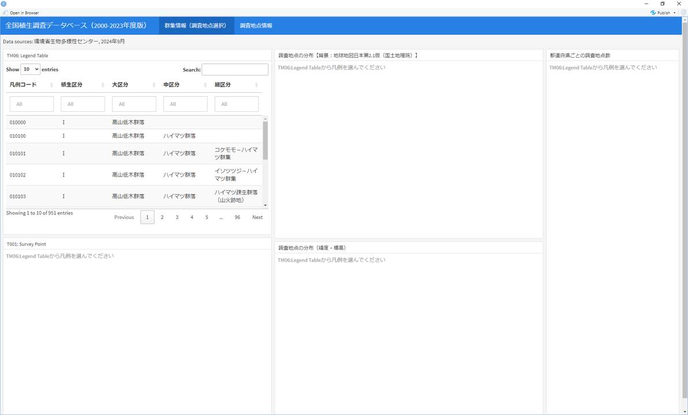
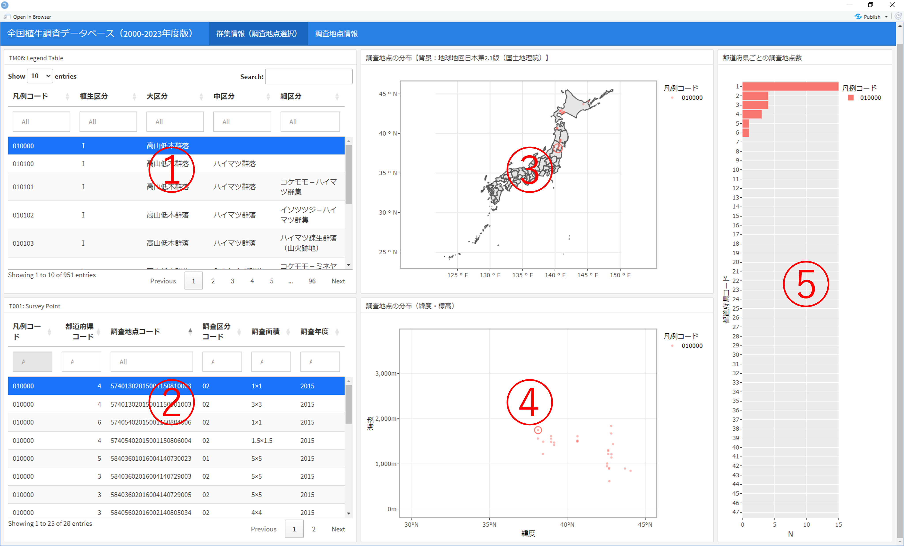

# 全国植生地図データベース用ダッシュボード
本サイトでは<a href="https://www.biodic.go.jp/">環境省生物多様性センター</a>が提供する全国植生地図データベース（アクセスファイル；mdb）のデータ表示用ダッシュボードを提供しています。

Rの<a href="https://pkgs.rstudio.com/flexdashboard/">flexdashboardパッケージ</a>を活用し，データベースの「frm_データ表示」で表示される調査地点の概要や出現種の情報に加えて，凡例区分ごとの分布図や都道府県毎の集計結果，調査地点の位置図や空中写真を表示できるようにしました。<a href="https://github.com/r-spatial/rgee">rgeeパッケージ</a>を利用することで，Google Earth Engineから調査地点の衛星データを取得し表示させることもできます。

自由に改変していただいてかまいませんので，各自のやりたいことに合わせてレイアウトなどを変更して使っていただければ幸いです。

## 全国植生地図データベースについて
全国植生調査データベースは，環境省生物多様性センターが実施している1/2.5万植生図作成業務における植生調査データを整理したものです。

2024年9月に公開されたデータベース（2000-2023年度版）では81,836地点のデータが格納されています。データは，Braun-Blanquet(1964)による植物社会学的全推定法による組成調査が行われ「T002植物表」を含む地点と，植生図作成のための補足的な優占種調査が行われ「T002植物表」を含まない地点に分かれます。

| 調査区分コード | 調査区分名 | 内容 | T001調査地点一覧 | T002植物表 | 備考 | 調査地点数 |
| -- | -------------- | --------| -------------- | ---------- | ---- | --------- |
| 01 | 優占種調査　１ | 相観調査 | ○ | ー | 植生図作成業務で独自に作成された「T002植物表」を略した調査 | 31,109 |
| 02 | 組成調査  | 植物社会学的な全種調査 | ○ | ○ | 「T001調査地点一覧」「T002植物表」は調査地点コードでリンク | 46,159 |
| 03 | 組成（資料） | 既存資料から引用した組成調査 | ○ | ○ | 「T001調査地点一覧」の緯度経度や調査年月日が不明の場合がある | 1,071 |
| 04 | 優占種（資料） | 既存資料等による優占種調査 | ○ | ー |  | 10 |
| 05 | 優占種調査　２ | 植生配分（景観）調査 | ○ | ー | 植生図作成業務で独自に作成された「T002植物表」を略した調査。「T001調査地点一覧」に中心となる植生を記録。「T001調査地点一覧」の緯度経度は対象植生の位置と調査者の位置（視点位置）が混在しているので注意。 | 3,487 |

※調査地点数を除いて「全国の植生調査データベース（PDF）」表3より引用

### データベースファイルの取得
本サイトでは，植生地図データベースのファイルは提供していません。

利用を希望する方は，<a href="https://www.biodic.go.jp/">環境省生物多様性センター</a>の<a href="http://gis.biodic.go.jp/webgis/sc-006.html">植生調査のページ</a>に掲載されている「全国の植生調査データベース（PDF）」記載の専用窓口へメールで依頼してください。ダウンロードURLが送られてきますので，ファイルを取得できます。

## Rの設定
ファイルはrmarkdownファイルです。なお，検証はWindows環境で行っており，他のOSでの利用については申し訳ありませんが不明です。
### アクセスファイルの読み込み設定
14行目に，植生地図データベースのファイルパスを設定します。

ドライバ等の設定が必要ですので，<a href="https://zenn.dev/carook/articles/carook-zenn-r-access">RでMicrosoft Accessのデータベースファイルを読込・操作する</a>を参考にしてください。

### 日本地図データの取得
15行目に，分布図の背景となる日本地図のファイルパスを設定します。

ここでは，<a href="https://www.gsi.go.jp/top.html">国土地理院</a>が作成した<a href="https://www.gsi.go.jp/kankyochiri/gm_jpn.html">地球地図日本</a>の行政界データの利用することとしています（が，別のデータを使うこともできます）。詳しくは，<a href="https://zenn.dev/carook/articles/carook-zenn-r-mapjapan#ベクタ境界データの利用（tmap，ggplot2）">Rで日本地図を描く方法</a>を参考にしてください。

### Google Earth Engineの利用
markdownファイルの17-18行目でGoogle Earth Engineの利用に必要な情報を設定します。```gee```は標準でFalseにしていますので，利用したい場合はTrueに変えてください。

```R
### Google Earth Engineの設定
gee <- T
gee_project <- 'プロジェクト名'
```

Google Earth Engineの利用については，<a href="https://zenn.dev/carook/articles/carook-zenn-r-rgee01">RでGoogle Earth Engineを操作できるようにする</a>を参考にしてください。

ダッシュボードではSentinel-2データをCloud Score+データセットを利用して雲除去をした上で表示させるようにしています。コードをそのまま利用する場合には，earthengine-apiがrgeeパッケージで検証されたバージョンよりも新しいものを利用するため，<a href="https://zenn.dev/carook/articles/carook-zenn-r-rgee07">RでHansenGlobalForestChangeデータと雲除去したSentinel画像を表示してみる</a>を参考に，earthengine-apiを1.1.0以上としてください。なお，Rへのデータ読み込みはないので，ee_sessioninfo.Rの読み込みは不要です。

## ダッシュボードの概要
### 初期画面


### 群集情報（調査地点選択）


### 調査地点情報

